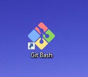
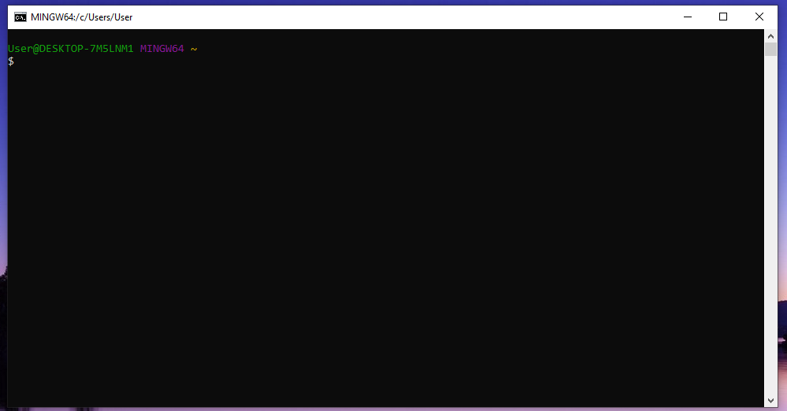

# Установка.

1) Прежде чем вы сможете пользоваться всеми возможностями GIT, его нужно [установить](https://git-scm.com/downloads).(Выбираем нужную вам операционную систему, скачиваем и устанавливаем)

2) После устанвки приложения, на рабочем столе у вас появится ярлык программы. Запускаем!

     

    Первое с чем вы столкнетесь после запуска программы - это консоль.
    

   В консоле необходимо прописать 
   *  git config --global user.name "Your Name"
   *  git config --global user.email "your_email" 

Делается это один раз и служит для того, что бы все ваши коммиты содержали информацию о вас.

***Поздравляю! Первый шаг выполнен.*** 

[Вернуться в начало.](./readme.md) 

